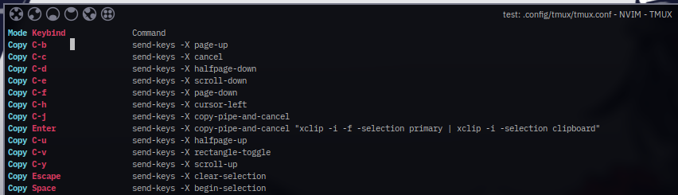

# Tmux lskeys




a prettier list-keys for tmuxa


## installation

clone repo `git clone https://github.com/eylles/tmux-lskeys ~/clone/path`

Add this line to the bottom of .tmux.conf:
```
run-shell ~/clone/path/tmux-lskeys/main.tmux
```

Reload the tmux environment:

```
# type this in terminal
$ tmux source-file ~/.tmux.conf
```
